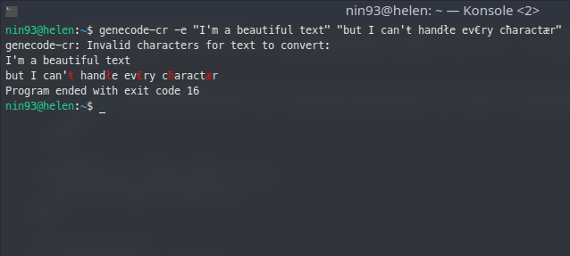

# genecode-cr

Genecode XY is a command-line Caesar Cipher developed in Crystal which turns texts into [DNA](https://en.wikipedia.org/wiki/DNA.)-[RNA](https://en.wikipedia.org/wiki/RNA) sections.
You can use the command `genecode-cr --encode "text here"` to codify an ordinary text, or decode DNA-RNA coded texts like "TCTGCCUCGUCTGTUUGCAACTCTUATUATAUGUGA".

You will need a key to both encode or decode a text. Crypted texts have unique key, of course, but you can choose one from 0 up to 121 for encoding with `--key` option or leave it random by omitting it.

The wise says:

  *"This program is for you, those little nerds who want*

  *to explore the beautiful amount of uselessness of talking*

  *whith other little nerds like you in an imaginary language"*.

  Are you not convinced yet? Give it a try and have fun!

## Installation

Install [crystal](https://crystal-lang.org/reference/installation) compiler.

Then:
```bash
git clone https://github.com/nin93/genecode-cr.git
cd genecode-cr
shards build --release --no-debug
# Optional: your binary is in bin/
sudo cp ./bin/genecode-cr /usr/local/bin/
```

## Usage
```
genecode-cr [-l|-u|-w] [(-e|-d) [-k <KEY>] [TEXT1 TEXT2 ...]]
```
Multiple text are allowed.

Standard input is read if no TEXT is given:
```
$ echo "foo" "bar" | genecode-cr -e -k 11
TUCTCUTCUUGCTUGTACTTTGGTUAG
```

### Encoding

You can encode a text without specifying the key, genecode-cr will provide it in that case.
```
$ genecode-cr --encode "I'm encoding with a random key!"
[key: 3]
AGUCACTTCUTATCTGAGTGCGATTCGTTGGAGTCUUTAGUCTTGGUTTCCUTATGAUTAGACTGAGAGTCGGATTTCUTATTATCTGGTUTUUGA
```
Every ASCII printable character is allowed, even newline char. For complete list type `genecode-cr --list`. You can nevertheless go ahead and skip text parsing by including `--unsafe` option.

**NOTE**: key shows up in standard error output.

### Decoding

Decoding is as simple as encoding.
You must provide a key in order to decode a text:
```
$ genecode-cr --decode -k 17 CTCUUATGTTAATAATATUUAATUUUATUUTAATTAUUUUAA
I need a key
```
Here text format is highly restricted and so do the error parsing, but you won't worry about that if texts come out from genecode-cr itself.

### Error handling
Invalid characters will cause an exception raise.
```
$ genecode-cr -e "I'm a beautiful text" "but I can'ŧ handłe ev€ry cħaractær"
genecode-cr: Invalid characters for text to convert:
I'm a beautiful text
but I can'ŧ handłe ev€ry cħaractær
Program ended with exit code 16
```
Errors will appear in red:


Use `--unsafe` option avoid exception raising, but output might be broken:
* Encoding
```
$ genecode-cr -e --unsafe "I can'ŧ handłe ev€ry cħaractær"
[key: 46]
UTGGATCTTCCCAUAGUUGATAATCCCAUACTACTUGATCTUACGAGTACUGATCTTCCCAGTCCCCTTAGUAGTUAG
```
```
$ genecode-cr -d -k 46 UTGGATCTTCCCAUAGUUGATAATCCCAUACTACTUGATCTUACGAGTACUGATCTTCCCAGTCCCCTTAGUAGTUAG
I can' hande evry caractr
```
* Decoding
```
$ genecode-cr -d --unsafe -k 59 UCCCTGCTGCTGCooopsTGCTGCTTCTCUAG
Uooo!!+%
```
It was:
```
$ genecode-cr -e -k 59 Uooooops
UCCCTGCTGCTGCTGCTGCTTCTCUAG
```

## Contributing

1. Fork it (<https://github.com/nin93/genecode-cr/fork>)
2. Create your feature branch (`git checkout -b my-new-feature`)
3. Commit your changes (`git commit -am 'Add some feature'`)
4. Push to the branch (`git push origin my-new-feature`)
5. Create a new Pull Request

## Contributors

- [Elia Franzella](https://github.com/nin93) - creator and maintainer
